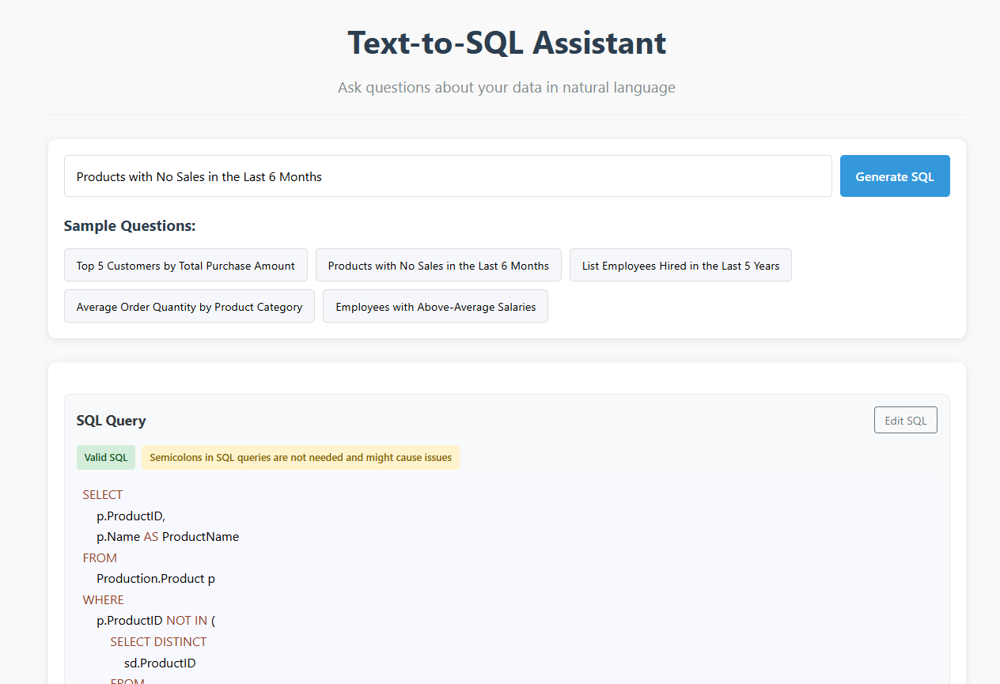

# Text-to-SQL Assistant

A natural language to SQL conversion system that enables non-technical users to query databases using plain English questions.

## Overview

This application allows business users to interact with SQL databases without needing to write SQL code themselves. Users can ask questions in natural language (e.g., "Show me the top 5 customers by revenue"), and the system will:

1. Generate the appropriate SQL query using AI
2. Validate the query for security and correctness
3. Execute the query against a SQL database
4. Return formatted results

The system is built specifically for Microsoft's AdventureWorks sample database but can be adapted to work with other databases as well.

## Architecture

The application follows a client-server architecture with a clear separation of concerns:

```
┌─────────────┐     ┌───────────────┐     ┌─────────────┐     ┌────────────┐
│ React UI    │────▶│ FastAPI       │────▶│ OpenAI API  │────▶│ SQL Server │
│             │◀────│ Backend       │◀────│             │◀────│ Database   │
└─────────────┘     └───────────────┘     └─────────────┘     └────────────┘

```

### Backend Components

1. **Schema Extractor**: Connects to the database and extracts schema information (tables, columns, relationships) to provide context for the AI.

2. **Prompt Engineering**: Crafts detailed prompts that include schema information and examples to guide the AI in generating accurate SQL.

3. **SQL Validator**: Validates generated SQL for security and correctness, including schema and column validation.

4. **Query Executor**: Executes validated SQL queries against the database and returns results.

5. **Feedback System**: Collects user feedback on query accuracy for potential future improvements.

### Frontend Components

1. **Natural Language Input**: An intuitive interface for entering questions in plain English.

2. **SQL Editor**: Displays generated SQL with syntax highlighting and allows manual editing.

3. **Results Viewer**: Shows query results in a formatted table.

4. **Feedback Component**: Allows users to provide feedback on query accuracy.

## Key Features

- **Natural Language Understanding**: Converts English questions to SQL using OpenAI's GPT models
- **SQL Validation**: Ensures queries are safe and valid before execution
- **Two-Step Process**: Separates SQL generation from execution for better control
- **Interactive SQL Editor**: Allows users to view and modify generated SQL
- **Error Correction**: Automatically attempts to fix invalid SQL queries
- **Schema & Column Validation**: Verifies referenced schemas and columns exist in the database
- **User Feedback Loop**: Collects feedback for improving future iterations

## Technology Stack

### Backend
- **Python 3.9+**
- **FastAPI**: Web framework for API endpoints
- **pyodbc/SQLAlchemy**: Database connectivity
- **OpenAI API**: Natural language to SQL conversion
- **SQLParse**: SQL query parsing and validation

### Frontend
- **React**: UI framework
- **Axios**: HTTP client
- **React Syntax Highlighter**: SQL code highlighting

### Database
- **SQL Server**: Database engine
- **AdventureWorks2022**: Sample database

## Assumptions & Design Decisions

1. **SQL Generation vs. Execution Separation**: 
   - The system separates SQL generation from execution to provide users with a review step for safety and accuracy.
   - This design choice increases security but adds an extra step to the workflow.

2. **SQL Validation First Approach**:
   - All SQL is validated before execution to prevent errors and security issues.
   - The system only allows SELECT statements for security reasons and to prevent accidents from the end user.

3. **Schema Context for Better SQL Generation**:
   - Database schema information is extracted and provided to the AI to improve query accuracy.
   - This approach helps generate more precise SQL but requires database access during initialization.

4. **Reliance on AdventureWorks Schema**:
   - The system is built with the AdventureWorks database structure in mind.
   - Adapting to other databases would require schema extraction and possibly prompt adjustments.

5. **Error Correction and Retry Logic**:
   - The system attempts to automatically fix SQL errors by sending error feedback to the AI.
   - This improves success rates but can occasionally lead to multiple attempts and slightly longer response times.

## Trade-offs

1. **OpenAI API Dependency vs. Independence**:
   - PRO: Using OpenAI's GPT models provides excellent natural language understanding.
   - CON: Creates a dependency on an external service and incurs API costs.

2. **Comprehensive Validation vs. Performance**:
   - PRO: Thorough SQL validation enhances security and accuracy.
   - CON: Multiple validation checks add processing overhead.

3. **Schema Extraction vs. Manual Configuration**:
   - PRO: Dynamic schema extraction makes the system adaptable to schema changes.
   - CON: Requires database access permissions and increases startup time.

4. **Two-Step Workflow vs. Immediate Execution**:
   - PRO: Adds a safety layer by letting users review SQL before execution.
   - CON: Requires an additional step in the user experience.

5. **Query Editing vs. Simplicity**:
   - PRO: Allows for manual SQL refinement when needed.
   - CON: Increases interface complexity and requires some SQL knowledge for full benefits.


## How To Run?

To run this project you first have to add your own openai api key to the backend's environment in docker-compose.yml, like this:

```
   environment:
   - DB_SERVER=host.docker.internal
   - DB_USER=sa
   - DB_PASSWORD=StrongPassword123!
   - DB_NAME=AdventureWorks2022
   - API_HOST=0.0.0.0
   - API_PORT=8000
   - OPENAI_API_KEY=[your key]
```

Than, run the project by opening starting docker and running:

```
docker compose up -d
```

After about 60-90 seconds, go to your browser and visit the url http://localhost/ where you can see my awesome project:




## Usage Examples

The system comes with several sample questions that demonstrate its capabilities:

- "Top 5 Customers by Total Purchase Amount"
- "Products with No Sales in the Last 6 Months"
- "List Employees Hired in the Last 5 Years"
- "Average Order Quantity by Product Category"
- "Employees with Above-Average Salaries"

## Development Notes

This project was built useing Cloude that genarate most of the code.


## Future Improvements

Potential enhancements for future versions:

1. **Conversation Memory**: Track context across multiple questions for follow-up queries
2. **RAG Implementation**: Add vector search for more efficient schema retrieval
3. **Expanded Database Support**: Add connectors for other database systems
4. **User Authentication**: Add user accounts and permission controls
5. **Query History**: Save past queries and results for reference
6. **Performance Optimization**: Add caching and optimize SQL validation